# Hi  My name is Omid Behzadpoor

## Computer Engineering student who loves building full-stack apps — from backend logic to clean UIs.

I'm a Computer Engineering student at Amirkabir University of Technology. I'm passionate about software engineering and enjoy building practical, real-world applications — from backend logic to clean, functional interfaces. I'm sharpening my skills through university coursework, and I like figuring out how systems work under the hood and turning ideas into working software.

- 🌍 I'm based in Tehran, Iran
- ✉️ You can contact me at [omidbehzadpoor1386@gmail.com](mailto:omidbehzadpoor1386@gmail.com)
- 🧠 I'm currently learning Java & backend architecture
- 👥 I'm looking to collaborate on full-stack and backend projects
- 💬 Ask me about clean code and better architecture ☕

### 🎯 My Contribution Graph, Animated

My GitHub contribution graph as a playful animated SVG — contribution boxes pop in sequence, generated daily from my real activity via [Readme-Contribution-Graph-Generator](https://github.com/Man0dya/Readme-Contribution-Graph-Generator).

### Socials

 <a href="https://www.github.com/OmidBehzadpoor" target="_blank" rel="noreferrer"> <picture> <source media="(prefers-color-scheme: dark)" srcset="https://raw.githubusercontent.com/danielcranney/readme-generator/main/public/icons/socials/github-dark.svg" /> <source media="(prefers-color-scheme: light)" srcset="https://raw.githubusercontent.com/danielcranney/readme-generator/main/public/icons/socials/github.svg" />  </picture> </a>  <a href="https://www.linkedin.com/in/omid-behzadpoor" target="_blank" rel="noreferrer"> <picture> <source media="(prefers-color-scheme: dark)" srcset="https://raw.githubusercontent.com/danielcranney/readme-generator/main/public/icons/socials/linkedin-dark.svg" /> <source media="(prefers-color-scheme: light)" srcset="https://raw.githubusercontent.com/danielcranney/readme-generator/main/public/icons/socials/linkedin.svg" />  </picture> </a>

### Badges

<b>My GitHub Stats</b>

<b>Top Repositories</b>

       
